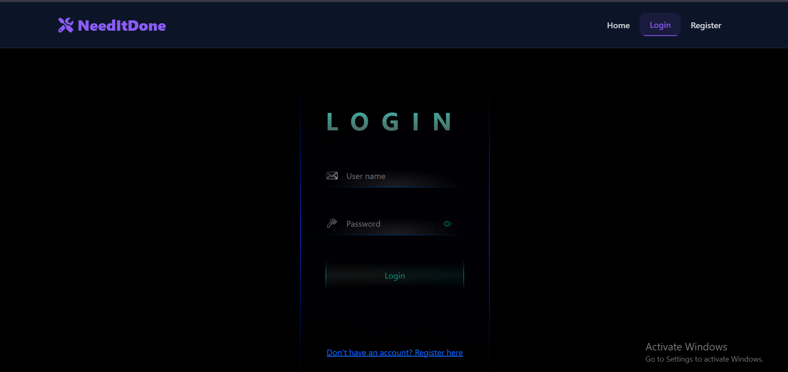
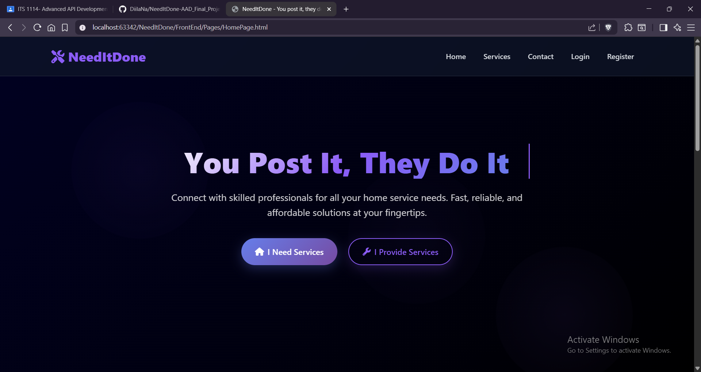
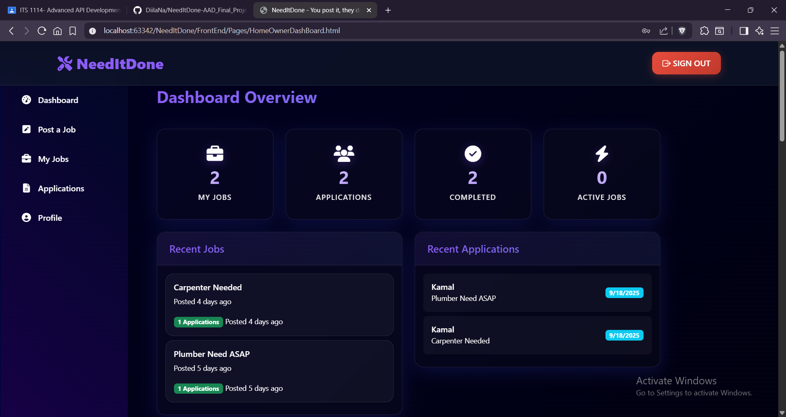
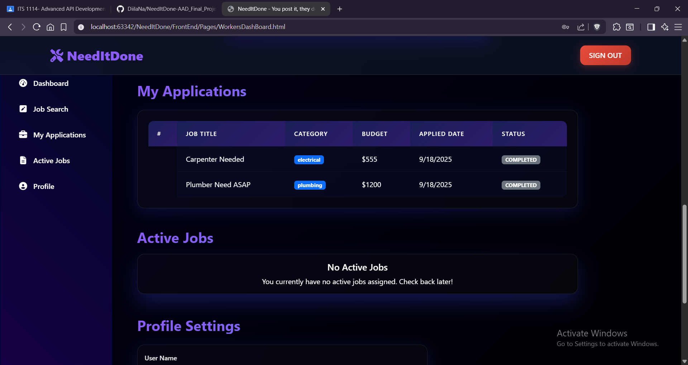
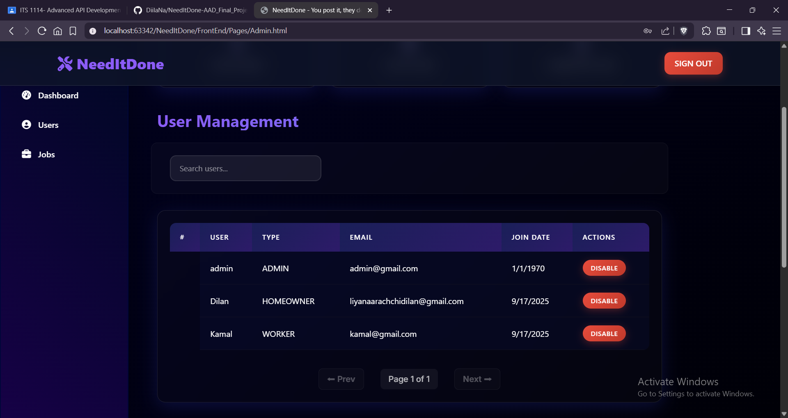

# NeedItDone – AAD Final Project (IJSE)

NeedItDone is a web-based platform designed to connect service providers (workers) with service seekers (homeowners).  
It allows homeowners to post jobs and manage applications, while workers can browse, apply, and manage job opportunities efficiently. 
Workers can be rated Homeowners and Admins will manage users and Job posts.

This project demonstrates **Spring Boot (Backend)** and **Html/Css/Bootstrap (Frontend)** integration with **JWT authentication, role-based access, and secure APIs**.

---

## 🚀 Project Purpose
The primary goal of **NeedItDone** is to:
- Provide a platform for homeowners to **post and manage jobs**.
- Enable workers to **search, apply, and manage applications**.
- Ensure **secure login & registration** with **JWT authentication and refresh tokens**.
- Offer dashboards tailored to both **homeowners** and **workers** and **admins**.
- Showcase practical use of **Spring Boot, REST APIs, Spring Security, JWT, MySQL, and Smtp Mail Sender**.

---

## 📸 Screenshots

### 🔑 Login Page

### 🔑 Home Page


### 🏠 Homeowner Dashboard


### 👷 Worker Dashboard


### 📋 Admin Dashboard

---

## ⚙️ Setup Instructions

### 1️⃣ Clone the Repository
```bash
git clone https://github.com/DiilaNa/NeedItDone-AAD_Final_Project_IJSE.git
cd NeedItDone-AAD_Final_Project_IJSE
```

---
### 2️⃣ Backend Setup (Spring Boot)

Navigate to the backend folder: cd backend

Configure the application.properties file with your local database:
```bash
spring.datasource.url=jdbc:mysql://localhost:3306/needitdone_db
spring.datasource.username=YOUR_DB_USERNAME
spring.datasource.password=YOUR_DB_PASSWORD
jwt.secret=YOUR_SECRET_KEY
jwt.expiration=3600000
jwt.refresh.expiration=86400000
```

Run the application:mvn spring-boot:run

The backend will start on http://localhost:8080

### 3️⃣ DB Setup

Add admin manuualy to the database.
        *Ex: username-admin , password - admin123*
```bash
INSERT INTO user (join_date, username, password, email, phone, role, status) 
VALUES (CURDATE(), 'admin', 
        '$2a$10$7znjmDpCbnz8f82iaEWeHueDN1cueR7k5eLPS6iYO6bLI4nhxE1TW', 
        'admin@gmail.com', '077918155', 'ADMIN', 'ACTIVE');
```
### 4️⃣ Frontend Setup (HTML/CSS/Bootstrap + jQuery)

Navigate to the frontend folder : cd frontend

Since the frontend is static HTML/CSS/JS:Simply open index.html in a browser, or Serve it via a lightweight server (e.g., Live Server in VS Code).The frontend will connect to the backend API running at http://localhost:8080

### 5️⃣ Access the Application

Visit the frontend in your browser. Register/login to explore Homeowner, Worker, and Admin flows.

## 🎥 Demo Video

📌 Watch the Demo on YouTube : (Upload your demo video and replace the link above. Use a title like: "NeedItDone – AAD Final Project (IJSE)")

## 🛠️ Tech Stack

- Backend: Spring Boot, Spring Security, JWT, Hibernate, MySQL
- Frontend: HTML, CSS, Bootstrap, jQuery
- Build Tools: Maven
- Version Control: GitHub

## 👨‍💻 Author
- Developed by ***Dilan Liyanaarachchi*** as part of the IJSE GDSE – Advanced API Development final project.

### 📌 GitHub Repo: https://github.com/DiilaNa/NeedItDone-AAD_Final_Project_IJSE.git

